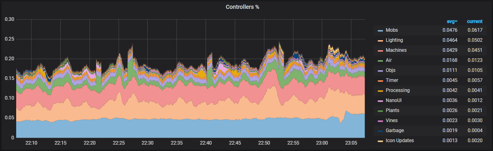

# Development docker environment

This directory contains files to run the game server alongside a miniature monitoring stack.



## Prerequisites

You will need to have the docker daemon running, and have docker-compose installed.

For prometheus metrics to work, you will need to define a COMMS_PASSWORD in your config.txt. Prometheus will automatically pick this up.

## Running

```shell
docker-compose up --build
```

This command will build the game server and bring it up alongside the monitoring stack. By using the --build flag, re-running this command will pick up any changes you make.

The game will run on port 8000 by default, so you should be able to just connect to byond://localhost:8000

## Accessing monitoring

Grafana is running on http://localhost:3000 with username `admin` and password `development`. The most useful graphs are in the Game dashboard.

Prometheus is running on http://localhost:9070, but most of what you can do here can be done easier in Grafana.
